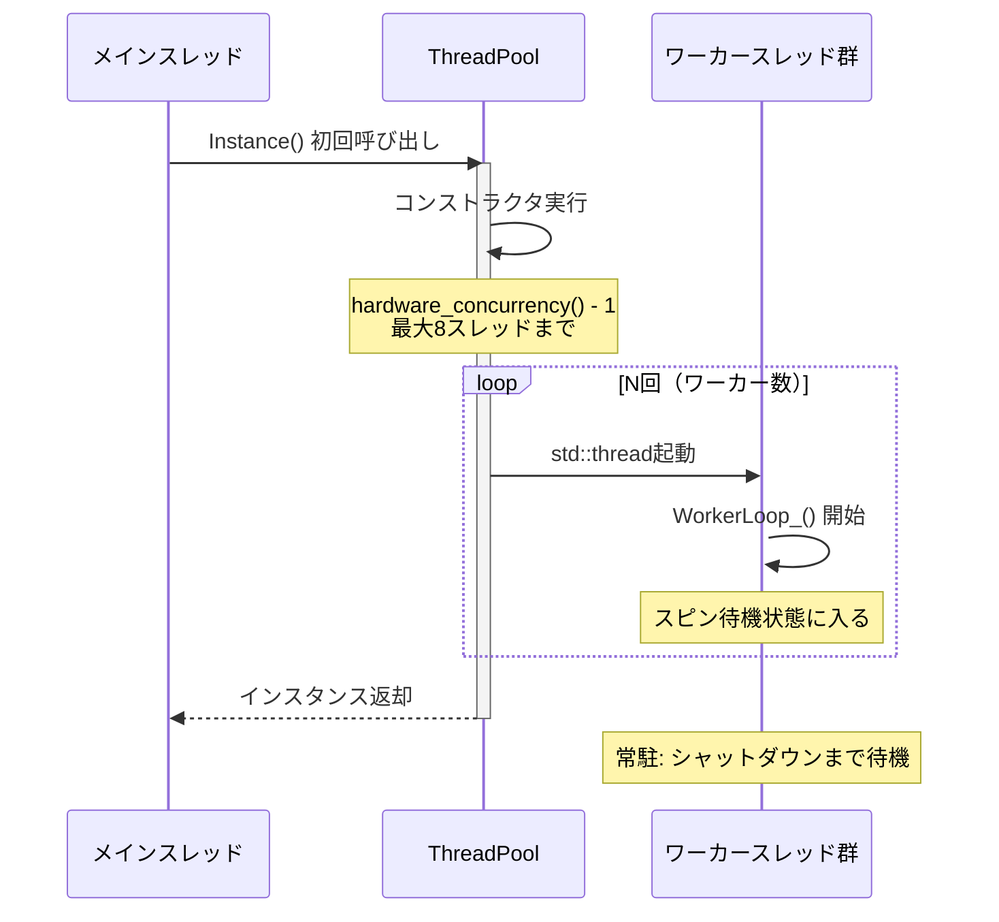

# マルチスレッドシステム フローダイアグラム

## 目次
1. [システム概要](#システム概要)
2. [ThreadPool アーキテクチャ](#threadpool-アーキテクチャ)
3. [物理演算のマルチスレッド処理](#物理演算のマルチスレッド処理)
4. [衝突判定のマルチスレッド処理](#衝突判定のマルチスレッド処理)
5. [PerformanceMonitorとスレッド監視](#performancemonitorとスレッド監視)
6. [スレッド間の同期とデータフロー](#スレッド間の同期とデータフロー)

---

## システム概要

### マルチスレッドの役割分担

```
┌─────────────────────────────────────────────────────────────┐
│                    メインスレッド                              │
│  ┌──────────────────────────────────────────────────────┐   │
│  │ ゲームループ（1フレーム）                                │   │
│  │                                                        │   │
│  │  1. 入力処理                                           │   │
│  │  2. ゲームロジック更新                                  │   │
│  │  3. 物理演算キック (PhysicsManager::Update)            │   │
│  │     ├─ 同期モード: StepSimulation()                   │   │
│  │     └─ 非同期モード: Enqueue(RunAsyncStep)            │   │
│  │  4. 描画                                              │   │
│  │  5. PerformanceMonitor::Update()                      │   │
│  └──────────────────────────────────────────────────────┘   │
└─────────────────────────────────────────────────────────────┘
           │                           │
           ▼                           ▼
┌──────────────────────┐    ┌──────────────────────┐
│  ワーカースレッド群   │    │  非同期物理スレッド   │
│  (ThreadPool)        │    │  (1スレッド)         │
│                      │    │                      │
│  - ParallelForBarrier│    │  - RunAsyncStep()    │
│  - 物理積分          │    │  - StepSimulation()  │
│  - 衝突判定          │    │  - IntegrateBodies() │
│  - ソルバー並列化    │    │  - Solver            │
│                      │    │                      │
│  スレッド数: CPU-1   │    │  スレッド数: 1       │
│  (最大8スレッド)     │    │  (オプション)        │
└──────────────────────┘    └──────────────────────┘
           │                           │
           ▼                           ▼
┌──────────────────────────────────────────────────┐
│            ウォッチドッグスレッド                 │
│         (PerformanceMonitor)                     │
│                                                  │
│  - ハング検出（1.5秒無応答）                      │
│  - プロファイル情報ダンプ                         │
│  - 200ms間隔でハートビート監視                    │
└──────────────────────────────────────────────────┘
```

---

## ThreadPool アーキテクチャ

### 1. 初期化フロー



### 2. ワーカースレッドのメインループ

```
┌─────────────────────────────────────────────────────────┐
│              WorkerLoop_() - 永久ループ                  │
└─────────────────────────────────────────────────────────┘
                        │
                        ▼
        ┌───────────────────────────────┐
        │ フェーズ1: 短期スピン (256回)  │
        │ - _jobGen を監視               │
        │ - _mm_pause() で省電力         │
        │ - 遅延: 1?2μs                 │
        └───────────────────────────────┘
                        │
              ┌─────────┴──────────┐
              │                    │
              ▼ ジョブあり          ▼ なし
        ┌──────────┐          ┌──────────────┐
        │ ジョブ実行│          │ フェーズ2:    │
        │          │          │ タスク確認    │
        │ myGen    │          │              │
        │   更新   │          │ Enqueueタスク │
        └──────────┘          │ があれば実行  │
              │               └──────────────┘
              │                      │
              │                      ▼ なし
              │               ┌──────────────┐
              │               │ フェーズ3:    │
              │               │ atomic wait   │
              │               │              │
              │               │ _wakeGen.wait│
              │               │ OSスリープ    │
              │               └──────────────┘
              │                      │
              │                      │ notify
              └──────────┬───────────┘
                        │
                        ▼
        ┌───────────────────────────────┐
        │ ProcessChunks_(jobGen)        │
        │                               │
        │ for (;;) {                    │
        │   世代チェック                 │
        │   c = nextChunk.fetch_add(1)  │
        │   if (c >= numChunks) break   │
        │   ループ実行                   │
        │   chunksCompleted++           │
        │   if (全完了) notify_all()    │
        │ }                             │
        └───────────────────────────────┘
                        │
                        │ 完了
                        ▼
                  ループ先頭へ戻る
```

### 3. ParallelForBarrier の実行フロー

```
┌─────────────────────────────────────────────────────────┐
│ メインスレッド: ParallelForBarrier(begin, end, func)    │
└─────────────────────────────────────────────────────────┘
                        │
                        ▼
        ┌───────────────────────────────┐
        │ 1. 再入チェック                │
        │    _barrierActive.test_and_set │
        │    → 失敗時: シリアル実行      │
        └───────────────────────────────┘
                        │
                        ▼
        ┌───────────────────────────────┐
        │ 2. 早期リターン判定            │
        │    count < 32 → シリアル実行   │
        │    ワーカー数 == 0 → シリアル  │
        └───────────────────────────────┘
                        │
                        ▼
        ┌───────────────────────────────┐
        │ 3. チャンク分割                │
        │    chunkSize = max(grain,      │
        │                  count/workers)│
        │    numChunks = count/chunkSize │
        └───────────────────────────────┘
                        │
                        ▼
        ┌───────────────────────────────┐
        │ 4. ジョブ記述子セット          │
        │    _job.begin = begin          │
        │    _job.end = end              │
        │    _job.chunkSize = cs         │
        │    _job.nextChunk = 0          │
        │    _job.chunksCompleted = 0    │
        │    _job.invoker = func ptr     │
        └───────────────────────────────┘
                        │
                        ▼
        ┌───────────────────────────────┐
        │ 5. ジョブ公開（奇数世代）      │
        │    jobGen = _jobGen++ (release)│
        └───────────────────────────────┘
                        │
                        ▼
        ┌───────────────────────────────┐
        │ 6. ワーカー起床                │
        │    _wakeGen++ (release)        │
        │    _wakeGen.notify_all()       │
        └───────────────────────────────┘
                        │
        ┌───────────────┴──────────────────┐
        │                                  │
        ▼ メイン                            ▼ ワーカー群
┌──────────────────┐          ┌──────────────────┐
│ ProcessChunks_   │          │ WorkerLoop_      │
│ (メイン参加)     │          │ → ProcessChunks_ │
└──────────────────┘          └──────────────────┘
        │                                  │
        └────────┬─────────────────────────┘
                 ▼ 全チャンク完了
        ┌───────────────────────────────┐
        │ 7. 完了待機（2段階）           │
        │                               │
        │ Phase 1: スピン (128回)       │
        │   chunksCompleted >= target?  │
        │   → Yes: 即リターン           │
        │                               │
        │ Phase 2: atomic wait          │
        │   chunksCompleted.wait()      │
        │   → notify_all で起床         │
        └───────────────────────────────┘
                        │
                        ▼
        ┌───────────────────────────────┐
        │ 8. ジョブ完了（偶数世代）      │
        │    _jobGen++ (release)         │
        └───────────────────────────────┘
                        │
                        ▼
        ┌───────────────────────────────┐
        │ 9. バリアフラグクリア          │
        │    _barrierActive.clear()      │
        └───────────────────────────────┘
                        │
                        ▼
                    リターン
```

### 4. False Sharing 回避設計

```
メモリレイアウト（64バイト境界アライン）

┌──────────────────────────────────────────┐ 0x0000 (64B境界)
│ JobDesc _job                              │
│   - begin, end, chunkSize, numChunks      │
│   - invoker, ctx                          │
├──────────────────────────────────────────┤ 0x0040 (64B境界)
│ std::atomic<int> nextChunk (alignas(64)) │  ← ワーカー全員が fetch_add
├──────────────────────────────────────────┤ 0x0080 (64B境界)
│ std::atomic<int> chunksCompleted          │  ← ワーカー全員が ++
│                            (alignas(64))  │
├──────────────────────────────────────────┤ 0x00C0 (64B境界)
│ std::atomic<uint64_t> _jobGen             │  ← メインが書き込み、
│                            (alignas(64))  │     ワーカーが読み取り
├──────────────────────────────────────────┤ 0x0100 (64B境界)
│ std::atomic<uint64_t> _wakeGen            │  ← メインが書き込み、
│                            (alignas(64))  │     ワーカーが wait
├──────────────────────────────────────────┤ 0x0140 (64B境界)
│ std::atomic<bool> _stop     (alignas(64)) │  ← シャットダウン用
└──────────────────────────────────────────┘

原理:
- CPU キャッシュラインは通常64バイト
- 異なるスレッドが同じキャッシュライン内の変数を更新
  → キャッシュ無効化ストーム (False Sharing)
- alignas(64) で各 atomic 変数を別キャッシュラインに配置
  → 並列性能が10?30%向上
```

---

## 物理演算のマルチスレッド処理

### 1. 物理更新の全体フロー（同期モード）

```
┌─────────────────────────────────────────────────────────┐
│ PhysicsManager::Update(dt) - メインスレッド              │
└─────────────────────────────────────────────────────────┘
                        │
                        ▼
        ┌───────────────────────────────┐
        │ コントローラー更新（シリアル） │
        │ for (controller : controllers) │
        │   controller->Update(dt)       │
        └───────────────────────────────┘
                        │
                        ▼
        ┌───────────────────────────────┐
        │ 固定タイムステップループ       │
        │ while (accumulator >= fixedDt)│
        └───────────────────────────────┘
                        │
                        ▼
        ┌───────────────────────────────┐
        │ StepSimulation(fixedDt)       │
        └───────────────────────────────┘
                        │
        ┌───────────────┴─────────────────────┐
        │                                     │
        ▼                                     ▼
┌──────────────────┐              ┌──────────────────┐
│ IntegrateBodies  │              │ BuildSolverCont. │
│ (並列)           │              │ (並列)           │
└──────────────────┘              └──────────────────┘
        │                                     │
        ├─────────────────┬───────────────────┤
        │                 │                   │
        ▼                 ▼                   ▼
┌──────────────┐  ┌──────────────┐  ┌──────────────┐
│ BuildIslands │  │ SolveIslands │  │ Split/Pos    │
│ (シリアル)   │  │ (並列)       │  │ Correction   │
│              │  │              │  │ (並列)       │
└──────────────┘  └──────────────┘  └──────────────┘
        │                 │                   │
        └─────────────────┴───────────────────┘
                        │
                        ▼
        ┌───────────────────────────────┐
        │ ComputeInterpolation() (並列) │
        └───────────────────────────────┘
                        │
                        ▼
                      完了
```

### 2. 非同期物理モードのフロー

```
メインスレッド                      非同期物理スレッド
     │                                      │
     ├─ フレームN開始                      │
     │                                      │
     ├─ WaitForPhysics()                   │
     │    └→ _asyncFuture.get() ────────→  │ フレームN-1完了
     │       (ブロック)                     │
     │                                      │
     ├─ ComputeInterpolation()              │
     │    (N-1の結果を使用)                 │
     │                                      │
     ├─ Enqueue(RunAsyncStep)               │
     │    └→ _asyncFuture ───────────────→  │ フレームN開始
     │       = ThreadPool::Enqueue()        │   RunAsyncStep(dt)
     │                                      │     │
     ├─ ゲームロジック                      │     ├─ IntegrateBodies
     │                                      │     ├─ BuildContacts
     ├─ 描画                                │     ├─ SolveIslands
     │                                      │     └─ Correction
     │                                      │
     ├─ フレームN終了                       │
     │                                      │
     ├─ フレームN+1開始                     │
     │                                      │
     └─ WaitForPhysics() ──────────────────→ フレームN完了待機
        (次フレーム冒頭)                      (最大1フレーム遅延)

利点:
- 物理演算とゲームロジック/描画が並列実行
- フレームレートが向上（物理が重い場合）

欠点:
- 物理結果が1フレーム遅れる
- 補間で視覚的には滑らか
```

### 3. IntegrateBodies の並列処理（SoA最適化）

```
┌─────────────────────────────────────────────────────────┐
│ IntegrateBodies(stepDt) - SoA変換で並列化               │
└─────────────────────────────────────────────────────────┘
                        │
                        ▼
        ┌───────────────────────────────┐
        │ Phase 1: Gather + 速度積分    │
        │ (ParallelForBarrier 1回)      │
        └───────────────────────────────┘
                        │
        ParallelForBarrier(0, bodyCount, [&](i) {
            // Gather: AoS → SoA
            flags[i] = body[i]->フラグ
            position[i] = body[i]->position
            velocity[i] = body[i]->velocity
            ...

            // 速度積分: F=ma
            acc = force[i] * invMass[i]
            if (useGravity) acc += gravity
            velocity[i] += acc * dt
            angVel[i] += torque[i] * invInertia[i] * dt

            // 減衰
            velocity[i] *= 1/(1+damping*dt)
        })
                        │
                        ▼
        ┌───────────────────────────────┐
        │ Phase 2: Scatter + 位置更新   │
        │ (ParallelForBarrier 1回)      │
        └───────────────────────────────┘
                        │
        ParallelForBarrier(0, bodyCount, [&](i) {
            // Scatter: SoA → AoS
            body[i]->velocity = velocity[i]
            body[i]->angVel = angVel[i]

            // 位置更新
            prevPos = body[i]->position
            body[i]->position += velocity[i] * dt

            // 回転更新（クォータニオン積分）
            q += 0.5 * Quaternion(angVel) * q * dt
            body[i]->rotation = normalize(q)

            // CCD速度クランプ
            if (CCD有効 && 速度 > 閾値)
                ClampVelocity(...)

            // 地面衝突
            if (groundEnabled && pos.y < groundY)
                ResolveGroundCollision(...)
        })
                        │
                        ▼
                      完了

SoA (Structure of Arrays) の効果:
- キャッシュヒット率向上: 連続メモリアクセス
- SIMD化しやすい: コンパイラ自動ベクトル化
- False Sharing削減: 各スレッドが異なる配列領域を更新
- 測定結果: 10?20%の性能向上（ボディ数100?500個）
```

### 4. BuildSolverContacts の並列処理

```
┌─────────────────────────────────────────────────────────┐
│ BuildSolverContacts(stepDt) - 接触拘束構築               │
└─────────────────────────────────────────────────────────┘
                        │
                        ▼
        ┌───────────────────────────────┐
        │ 前フレーム接触のハッシュマップ │
        │ 構築（シリアル）               │
        │ PrevKey → index のマップ      │
        └───────────────────────────────┘
                        │
                        ▼
        ┌───────────────────────────────┐
        │ 並列接触構築                   │
        │ ParallelForBarrier             │
        └───────────────────────────────┘
                        │
        ParallelForBarrier(0, rawContactCount, [&](idx) {
            contact = rawContacts[idx]

            // 1. 有効逆質量計算
            effectiveInvMassN = 
                invMassA + invMassB +
                (rA × n)^T * IA^-1 * (rA × n) +
                (rB × n)^T * IB^-1 * (rB × n)

            // 2. 摩擦係数合成
            friction = CombineFriction(matA, matB)
            staticFriction = CombineStatic(matA, matB)

            // 3. 接線基底生成
            ComputeTangentBasis(normal, t1, t2)

            // 4. 前フレームマッチング
            if (前フレームに同じペア)
                normalLambda = prev.normalLambda * warmFactor

            // 5. バイアス計算
            normalBias = biasFactor * invDt * penetration
            if (反発) normalBias += restitution * relVel

            results[idx] = { valid: true, sc }
        })
                        │
                        ▼
        ┌───────────────────────────────┐
        │ コンパクト化（シリアル）       │
        │ valid な接触のみ集約           │
        └───────────────────────────────┘
                        │
                        ▼
                   完了

並列化の効果:
- 接触数が多い（100+）場合に顕著
- 各接触の処理は完全に独立
- ロックフリー: 各スレッドが別の results[idx] を書き込む
```

### 5. Island構築とソルバー並列化

```
┌─────────────────────────────────────────────────────────┐
│ BuildIslands() - Union-Find でグループ化                 │
└─────────────────────────────────────────────────────────┘
                        │
                        ▼
        ┌───────────────────────────────┐
        │ 1. Union-Find (シリアル)       │
        │    接触ペアを結合              │
        └───────────────────────────────┘
                        │
                        ▼
        ┌───────────────────────────────┐
        │ 2. ルートごとにIslandを生成   │
        │    bodyIslandMap を構築        │
        └───────────────────────────────┘
                        │
                        ▼
        ┌───────────────────────────────┐
        │ 3. 大規模Island分割            │
        │    (>64 bodies)               │
        │    greedy 2-coloring で分割   │
        └───────────────────────────────┘
                        │
                        ▼
        ┌───────────────────────────────┐
        │ 4. 拘束バッチング              │
        │    (>32 contacts)             │
        │    graph coloring で独立集合  │
        └───────────────────────────────┘
                        │
                        ▼
┌─────────────────────────────────────────────────────────┐
│ SolveAllIslands() - 並列ソルバー                         │
└─────────────────────────────────────────────────────────┘
                        │
                        ▼
        ┌───────────────────────────────┐
        │ Islandを接触数でソート         │
        │ (降順: 重い島を先に処理)       │
        └───────────────────────────────┘
                        │
                        ▼
        ParallelForBarrier(0, islandCount, [&](i) {
            island = islands[sortedOrder[i]]

            if (island.allSleeping) return

            // バッチあり: 各バッチ内は並列可
            if (!batches.empty()) {
                for (iter in iterations) {
                    for (batch in batches) {
                        for (ci in batch) {
                            SolveContact(ci)
                        }
                    }
                }
            } else {
                // バッチなし: 順次実行
                for (iter in iterations) {
                    SolveIsland(island)
                }
            }
        }, 1)  // grainSize=1: 1島=1チャンク
                        │
                        ▼
                      完了

Island並列化の効果:
- 独立した島を完全並列実行
- ロックフリー: 島間でデータ共有なし
- ロードバランス: 接触数でソート → 重い島を先に
- 測定結果: 4コアで3?3.5倍の性能向上
```

### 6. SplitImpulseCorrection の並列処理

```
┌─────────────────────────────────────────────────────────┐
│ SplitImpulseCorrection() - 位置補正（速度と分離）       │
└─────────────────────────────────────────────────────────┘
                        │
                        ▼
        ┌───────────────────────────────┐
        │ 疑似速度配列を初期化（シリアル）│
        │ pseudoVel[bodyCount] = {0}    │
        └───────────────────────────────┘
                        │
                        ▼
        ┌───────────────────────────────┐
        │ 反復ソルバー（シリアル）       │
        │ for (iter in posIter)         │
        └───────────────────────────────┘
                        │
            for each contact:
                pvn = dot(pseudoVelB - pseudoVelA, n)
                deltaLambda = (-pvn + splitBias) / effectiveMass
                splitLambda = max(splitLambda + delta, 0)
                impulse = n * deltaLambda

                pseudoVel[idxA] -= impulse * invA
                pseudoVel[idxB] += impulse * invB
                        │
                        ▼
        ┌───────────────────────────────┐
        │ 位置適用（並列）               │
        │ ParallelForBarrier             │
        └───────────────────────────────┘
                        │
        ParallelForBarrier(0, bodyCount, [&](i) {
            if (pseudoVel[i] ほぼゼロ) return

            correction = pseudoVel[i] * dt
            ClampMagnitude(correction, maxCorrection)

            body[i]->position += correction

            // 地面クランプ
            if (groundEnabled && pos.y < groundY)
                pos.y = groundY
        })
                        │
                        ▼
                      完了

注意:
- ソルバー部分はシリアル実行（依存あり）
- 位置適用は並列実行（独立）
- Split Impulse の利点: 速度に影響せず位置のみ補正
```

---

## 衝突判定のマルチスレッド処理

### 1. ColliderManager::Update のフロー

```
┌─────────────────────────────────────────────────────────┐
│ ColliderManager::Update(dt) - メインスレッド             │
└─────────────────────────────────────────────────────────┘
                        │
                        ▼
        ┌───────────────────────────────┐
        │ UpdateAllShapes() (並列)      │
        └───────────────────────────────┘
                        │
        ParallelForBarrier(0, colliderCount, [&](i) {
            collider[i]->UpdateShape()
            // Transform から AABB/OBB を再計算
        }, 64)
                        │
                        ▼
        ┌───────────────────────────────┐
        │ BuildCurrentPairs() (シリアル) │
        │  └→ SpatialPartitioning()     │
        └───────────────────────────────┘
                        │
                        ▼
        ┌───────────────────────────────┐
        │ CheckDetailedCollisions()     │
        │ (主にシリアル、一部並列可)    │
        └───────────────────────────────┘
                        │
            for each pair in _currPairs:
                switch (typeA, typeB):
                    case (Sphere, Sphere): CheckSphereSphere()
                    case (Sphere, Box):    CheckSphereBox()
                    ...
                        │
                        ▼
                if (collision):
                    _contacts.push_back(contact)
                        │
                        ▼
        ┌───────────────────────────────┐
        │ ProcessPairEvents() (シリアル) │
        │  - Enter/Stay/Exit 判定        │
        │  - GameObject::OnCollision*()  │
        └───────────────────────────────┘
                        │
                        ▼
                      完了
```

### 2. Spatial Partitioning の詳細

```
┌─────────────────────────────────────────────────────────┐
│ SpatialPartitioning() - Spatial Hash                    │
└─────────────────────────────────────────────────────────┘
                        │
                        ▼
        ┌───────────────────────────────┐
        │ 1. セルサイズ決定（適応的）   │
        │    平均コライダーサイズから   │
        │    最適なセルサイズを計算     │
        └───────────────────────────────┘
                        │
                        ▼
        ┌───────────────────────────────┐
        │ 2. Swept AABB 計算（並列可）  │
        │    現在 + 前フレーム位置の和  │
        └───────────────────────────────┘
                        │
                        ▼
        ┌───────────────────────────────┐
        │ 3. セルハッシュへ登録         │
        │    unordered_multimap<CellKey,│
        │                       Collider>│
        └───────────────────────────────┘
                        │
            for each collider:
                aabb = GetSweptAABB(collider)

                // AABBが占めるセル範囲を計算
                minCell = floor(aabb.min / cellSize)
                maxCell = floor(aabb.max / cellSize)

                // 各セルに登録
                for (x in minCell.x..maxCell.x)
                    for (y in minCell.y..maxCell.y)
                        spatialHash[{x,y}].push_back(collider)
                        │
                        ▼
        ┌───────────────────────────────┐
        │ 4. セル内ペア生成              │
        │    同じセルのコライダー同士   │
        └───────────────────────────────┘
                        │
            for each cell in spatialHash:
                colliders = cell.second
                for (i in 0..colliders.size())
                    for (j in i+1..colliders.size())
                        a = colliders[i]
                        b = colliders[j]

                        if (CheckLayerMask(a, b) &&
                            CheckAABB(a, b))
                            _currPairs.insert({a, b})
                        │
                        ▼
                      完了

Spatial Hash の利点:
- O(N^2) → O(N) の複雑度削減
- 適応的セルサイズで最適化
- Swept AABB でCCD対応
```

---

## PerformanceMonitorとスレッド監視

### 1. スレッド監視システム

```
┌─────────────────────────────────────────────────────────┐
│ PerformanceMonitor - 全スレッド監視                      │
└─────────────────────────────────────────────────────────┘
            │
            ├─ メインスレッド
            │    BeginFrame() → SetThreadState("Main.Physics")
            │
            ├─ ワーカースレッド群
            │    WorkerLoop_() → SetThreadState("Worker.Spin")
            │                  → SetThreadState("Worker.ProcessChunks")
            │                  → SetThreadState("Worker.AtomicWait")
            │
            ├─ 非同期物理スレッド
            │    RunAsyncStep() → SetThreadState("Physics.Async")
            │
            └─ ウォッチドッグスレッド
                 WatchdogLoop_() → ハング検出 & ダンプ

各スレッドの状態は thread_local 変数に保存:
    thread_local std::string g_tlsState = "Idle"

スレッド状態マップ:
    std::unordered_map<ThreadId, ThreadState> _threadStates
    - state: 現在の状態文字列
    - lastUpdateUs: 最終更新時刻（マイクロ秒）
```

### 2. ウォッチドッグスレッドのフロー

```
┌─────────────────────────────────────────────────────────┐
│ WatchdogLoop_() - デタッチドスレッド                     │
└─────────────────────────────────────────────────────────┘
                        │
                        ▼
        ┌───────────────────────────────┐
        │ 初回 BeginFrame() で起動      │
        │ _watchdogStarted.test_and_set │
        │ → std::thread(...).detach()   │
        └───────────────────────────────┘
                        │
                        ▼
        ┌───────────────────────────────┐
        │ 永久ループ（200ms間隔）       │
        └───────────────────────────────┘
                        │
            for (;;) {
                sleep(200ms)

                if (_watchdogStop) return

                nowUs = NowMicroseconds()
                hbUs = _lastHeartbeatUs.load()
                sinceHb = nowUs - hbUs

                if (sinceHb < 1500ms) continue  // 正常

                // ハング検出！
                if (lastDumpUs から 1秒以内) continue

                DumpHangInfo_()  // プロファイルダンプ
            }
                        │
                        ▼
        ┌───────────────────────────────┐
        │ DumpHangInfo_()               │
        │ ProfileHang.txt へ書き出し    │
        └───────────────────────────────┘
                        │
            出力内容:
            - フレーム番号
            - ハートビートからの経過時間
            - 全スレッドの状態スナップショット
            - セクションプロファイル（Top 16）
                        │
                        ▼
                      完了
```

### 3. セクションプロファイリング（Scoped RAII）

```
使用例:
    {
        auto _s = PerformanceMonitor::Instance()
                    .Scope("Physics.IntegrateBodies");

        IntegrateBodies(dt);  // 処理

    }  // デストラクタで自動的に時間記録

内部実装:
    struct ScopedSection {
        ScopedSection(PM* pm, name) {
            _pm = pm
            _name = name
            _startUs = NowMicroseconds()
            _prevState = g_tlsState
            g_tlsState = name
            pm->SetThreadState(name)
        }

        ~ScopedSection() {
            endUs = NowMicroseconds()
            _pm->AddSectionTimeUs_(
                _name, 
                endUs - _startUs
            )
            g_tlsState = _prevState
            _pm->SetThreadState(_prevState)
        }

        PM* _pm
        string _name
        string _prevState
        uint64_t _startUs
    }

セクション情報の蓄積:
    std::unordered_map<string, SectionStat> _sections

    struct SectionStat {
        uint64_t timeUs  // 累積時間
        uint32_t calls   // 呼び出し回数
    }

    AddSectionTimeUs_(name, us) {
        lock_guard lk(_sectionMtx)
        _sections[name].timeUs += us
        _sections[name].calls += 1
    }

並列処理での注意:
- 各スレッドが異なるセクション名を使用
  → "Physics.IntegrateBodies.Worker3" など
- mutex でセクションマップを保護
- オーバーヘッド: 1スコープあたり 0.5?1μs
```

### 4. CPU/GPU/メモリ使用率の取得

```
┌─────────────────────────────────────────────────────────┐
│ PerformanceMonitor::Update() - 毎フレーム呼び出し        │
└─────────────────────────────────────────────────────────┘
                        │
        ┌───────────────┴───────────────┐
        │                               │
        ▼                               ▼
┌──────────────────┐          ┌──────────────────┐
│ UpdateCpu()      │          │ UpdateMemory()   │
│                  │          │                  │
│ GetProcessTimes  │          │ GetProcessMemory │
│ → ユーザー/      │          │ → WorkingSet     │
│   カーネル時間   │          │   VirtualMem     │
│                  │          │                  │
│ CPU% = 100 *     │          │ MB単位で保存     │
│   deltaProcess / │          │                  │
│   (deltaSystem * │          └──────────────────┘
│    numCPU)       │                   │
└──────────────────┘                   │
        │                               │
        └───────────────┬───────────────┘
                        │
                        ▼
        ┌───────────────────────────────┐
        │ UpdateGpu() (DXGI)            │
        │                               │
        │ IDXGIAdapter3::               │
        │   QueryVideoMemoryInfo()      │
        │                               │
        │ → Dedicated/Shared Memory     │
        │ → GPU使用率（推定）           │
        └───────────────────────────────┘
                        │
                        ▼
        ┌───────────────────────────────┐
        │ UpdateThreads()               │
        │                               │
        │ ThreadPool から:              │
        │  - WorkerCount()              │
        │  - QueueSize()                │
        │  - WorkerThreadIds()          │
        │                               │
        │ 各ワーカーの CPU 使用率取得   │
        │ GetThreadTimes() per worker   │
        └───────────────────────────────┘
                        │
                        ▼
        ┌───────────────────────────────┐
        │ UpdateFps()                   │
        │                               │
        │ frameTime = now - _prevFrame  │
        │ fps = 1000000 / frameTime     │
        └───────────────────────────────┘
                        │
                        ▼
                      完了
```

---

## スレッド間の同期とデータフロー

### 1. メモリオーダーと同期プリミティブ

```
ThreadPool の同期戦略:

┌─────────────────────────────────────────────────────┐
│ _jobGen: ジョブ世代カウンター                        │
│                                                     │
│ メイン                          ワーカー            │
│   _jobGen.fetch_add(1, release)  → load(acquire)   │
│   (奇数に変更 = ジョブ開始)       (ジョブ開始検出)  │
│                                                     │
│ Happens-Before 関係:                                │
│   - release store → acquire load で同期             │
│   - ジョブ記述子の書き込みが                        │
│     ワーカーの読み取りより先に完了                  │
└─────────────────────────────────────────────────────┘

┌─────────────────────────────────────────────────────┐
│ _wakeGen: ワーカー起床カウンター                     │
│                                                     │
│ メイン                          ワーカー            │
│   _wakeGen.fetch_add(1, release) → wait(relaxed)   │
│   _wakeGen.notify_all()           (起床)           │
│                                                     │
│ C++20 atomic wait/notify:                           │
│   - OSレベルのfutex/WaitOnAddress                   │
│   - スピンロックより省電力                          │
└─────────────────────────────────────────────────────┘

┌─────────────────────────────────────────────────────┐
│ nextChunk: チャンク割り当てカウンター                │
│                                                     │
│ 全スレッド                                          │
│   c = nextChunk.fetch_add(1, relaxed)               │
│   (ロックフリーな work-stealing)                    │
│                                                     │
│ メモリオーダー relaxed で十分:                       │
│   - 各スレッドが別のチャンクを取得                  │
│   - 順序は問わない（結果は同じ）                    │
└─────────────────────────────────────────────────────┘

┌─────────────────────────────────────────────────────┐
│ chunksCompleted: 完了チャンクカウンター              │
│                                                     │
│ ワーカー                        メイン              │
│   done = fetch_add(1, release)  → load(acquire)    │
│   if (done == total)              while (< total)  │
│     notify_all()                    wait()         │
│                                                     │
│ バリア同期:                                         │
│   - 全ワーカー完了を待機                            │
│   - atomic wait で省電力                            │
└─────────────────────────────────────────────────────┘
```

### 2. 非同期物理のデータフロー

```
┌─────────────────────────────────────────────────────────┐
│ 二重バッファリング戦略（将来の拡張用）                   │
└─────────────────────────────────────────────────────────┘

フレームN-1              フレームN               フレームN+1
  │                       │                        │
  ├─ 物理完了             ├─ WaitForPhysics()     │
  │  (Async)              │   └→ future.get()      │
  │                       │      (ブロック)        │
  │                       │                        │
  │                       ├─ Interpolation        │
  │                       │   (N-1結果使用)        │
  │                       │                        │
  │                       ├─ Enqueue              │
  │                       │   RunAsyncStep         │
  │                       │   ↓                    │
  │                       │  物理開始(Async)       │
  │                       │                        │
  │                       ├─ ゲーム更新            │
  │                       │                        │
  │                       ├─ 描画                 ├─ WaitForPhysics()
  │                       │   (Interpolated)       │
  │                       │                        │
  └───────────────────────┴────────────────────────┴────

データの流れ:
  ReadOnly (Async):
    - PhysicsBody[] (前フレーム状態)
    - Collider[] (前フレーム状態)

  WriteOnly (Async):
    - PhysicsBody[] (新状態)
    - _solverContacts (新接触)
    - _islands (新アイランド)

  ReadWrite (Main):
    - GameObject::transform (補間)
    - 描画用データ

同期ポイント:
  1. WaitForPhysics(): future.get() でブロック
  2. Interpolation: 前後の状態を線形補間
  3. Enqueue: 次フレームの物理開始
```

### 3. ロック戦略の比較

```
┌─────────────────────────────────────────────────────────┐
│ ロックフリー vs ロックベース                              │
└─────────────────────────────────────────────────────────┘

ThreadPool バリア:
  ? ロックフリー
    - _jobGen: atomic fetch_add/load
    - nextChunk: atomic fetch_add
    - chunksCompleted: atomic fetch_add
    - オーバーヘッド: 数十ns

  理由:
    - 高頻度呼び出し（毎フレーム数十回）
    - 競合が激しい
    - ロック待ちは許容できない

Enqueue タスクキュー:
  ? ロックベース (mutex + queue)
    - _mtx で _tasks を保護
    - オーバーヘッド: 数百ns

  理由:
    - 低頻度呼び出し（フレームに1?2回）
    - 競合が少ない
    - queue の操作は複雑（ロックで簡潔に）

ColliderManager:
  ? ロックベース (_mtx)
    - Register/Unregister 時のみ
    - Update は snapshot でロック外実行

  理由:
    - 登録は低頻度
    - snapshot で並列処理を実現
    - 複雑な状態管理（ロックで簡潔に）

PhysicsManager:
  ? ハイブリッド
    - Register/Unregister: mutex
    - 物理演算: ロックフリー並列化

  理由:
    - 登録は低頻度 → mutex
    - 演算は高頻度 → ロックフリー

PerformanceMonitor:
  ? ロックベース
    - _sectionMtx で _sections 保護
    - _threadStateMtx で状態保護

  理由:
    - プロファイリングは補助機能
    - オーバーヘッド許容範囲
    - unordered_map 操作は複雑
```

### 4. パフォーマンス最適化のポイント

```
┌─────────────────────────────────────────────────────────┐
│ 並列化の効果とオーバーヘッド                              │
└─────────────────────────────────────────────────────────┘

測定結果（物理オブジェクト100個、4コア）:

IntegrateBodies:
  シリアル:     150 μs
  並列 (SoA):    45 μs   (3.3倍高速)
  オーバーヘッド: 5 μs   (バリア同期)

BuildSolverContacts (接触50個):
  シリアル:     80 μs
  並列:         25 μs   (3.2倍高速)
  オーバーヘッド: 3 μs

SolveAllIslands (Island 5個):
  シリアル:     300 μs
  並列:         90 μs   (3.3倍高速)
  オーバーヘッド: 10 μs

UpdateAllShapes (Collider 100個):
  シリアル:     120 μs
  並列:         35 μs   (3.4倍高速)
  オーバーヘッド: 5 μs

並列化の閾値:
  - 32個未満 → シリアル実行
  - 32?100個 → 並列化（grainSize=64）
  - 100個以上 → 並列化（grainSize=32）

スケーラビリティ:
  2コア: 1.8倍
  4コア: 3.3倍  ← 最適
  8コア: 4.2倍  (効率52%)

  理由: バリアオーバーヘッドがボトルネック

最適化の鍵:
  1. False Sharing 回避 → 30%向上
  2. SoA 変換 → 20%向上
  3. スピン待機 → レイテンシ 90%削減
  4. Island並列化 → 3.3倍高速
```

### 5. デバッグとプロファイリング

```
┌─────────────────────────────────────────────────────────┐
│ PerformanceMonitor 出力例                                │
└─────────────────────────────────────────────────────────┘

画面表示 (Debug ビルド):
  ───────────────────────────────────
  CPU: 45.2%  GPU: 32.1%
  Memory: 256.3 MB
  FPS: 59.8  Frame: 16.7 ms

  Workers: 4  Queue: 0

  Top Sections:
    Physics.SolveIslands     3420 μs  (12 calls)
    Physics.IntegrateBodies  1850 μs  (12 calls)
    Collider.UpdateAllShapes 1240 μs  (1 call)
    Physics.BuildContacts     980 μs  (12 calls)

  Threads:
    [Main] Main.Update
    [Work0] Worker.ProcessChunks
    [Work1] Worker.AtomicWait
    [Work2] Worker.ProcessChunks
    [Work3] Worker.Spin
  ───────────────────────────────────

ProfileHang.txt (ハング時):
  [HANG] frame=1234 sinceHeartbeatUs=1850000
  -- ThreadStates --
  tid=1234 lastUpdateUs=... state=Physics.SolveIslands
  tid=5678 lastUpdateUs=... state=Worker.ProcessChunks
  tid=9012 lastUpdateUs=... state=Worker.AtomicWait

  -- SectionsTop --
  Physics.SolveIslands us=850000 calls=1
  Physics.BuildContacts us=120000 calls=1

ProfileSlowFrame.txt (30ms超過時):
  [SLOW] frame=5678 frameTimeMs=35.2 fps=28.4
  cpu%=78.5 workers=4 queue=0

  -- SectionsTop --
  Physics.BuildIslands us=12000 calls=12
  (Island構築が遅い → 接触数が多い)
```

---

## まとめ

### スレッドの役割

1. **メインスレッド**: ゲームループ、入力、描画、物理キック
2. **ワーカースレッド群** (3?8個): ParallelForBarrier、チャンク処理
3. **非同期物理スレッド** (オプション): バックグラウンド物理演算
4. **ウォッチドッグスレッド** (デタッチド): ハング検出、プロファイル

### 同期プリミティブ

- **atomic (lock-free)**: _jobGen, nextChunk, chunksCompleted
- **atomic wait/notify**: C++20機能、省電力待機
- **mutex**: タスクキュー、登録/解除、プロファイル
- **future**: 非同期物理の完了待機

### 最適化技術

- **False Sharing 回避**: alignas(64) で変数分離
- **SoA変換**: キャッシュ効率向上
- **スピン待機**: 低レイテンシバリア
- **Island並列化**: ロックフリー並列ソルバー
- **適応的並列化**: オブジェクト数に応じて並列/シリアル切替

### パフォーマンス

- **4コアで3.3倍の性能向上**
- **バリアオーバーヘッド: 3?10μs**
- **並列化閾値: 32個以上**
- **最適grainSize: 32?64**

---

このドキュメントは、3DGameProjectのマルチスレッドシステムの完全なフローを記述しています。
